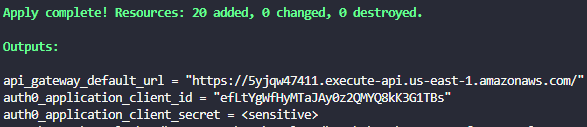
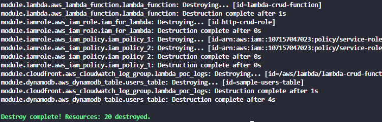

# AWS and Auth0 Sample Custom Database Demo

This terraform project allows you stand up an AWS DynamoDB, API Gateway and Auth0 Custom Database.

For additional information about Terraform AWS and Auth0 providers click the following links:

* [AWS Terraform Provider](https://registry.terraform.io/providers/hashicorp/aws/latest/docs)
* [Auth0 Terraform Provider](https://registry.terraform.io/providers/auth0/auth0/0.30.2)

## Disclaimer :warning:
---

This project serves as a Sample Application, that you can tweak or completely re-purpose.

## Prerequisties
* Terraform v1.1.9+
* Amazon Web Service (AWS) Tenant -- If you do not already have an AWS Tenant, you can create one [here](https://portal.aws.amazon.com/billing/signup#/start/email).
* Auth0 Tenant - If you do not already an Auth0 tenant, you can register for a free here: [Auth0 Free Plan](https://auth0.com/signup)

### Demo Setup Steps

1. After setting up your AWS instance, find your Account ID and save it for later.  [How-To](https://docs.aws.amazon.com/general/latest/gr/acct-identifiers.html#FindingYourAccountIdentifiers)

2. Create an IAM User with programmatic access and grant the user admin level access.  Download the credentials .csv file and save it for later. [How-To](https://docs.aws.amazon.com/IAM/latest/UserGuide/id_users_create.html#id_users_create_console)

3. In your Auth0 instance, create a new Machine to Machine application and capture the following info: 
```powershell
Domain, Client ID, and Client Secret
```

4. In the APIs section, authorize your application with Auth0 Management API.  Enable the following scopes:
```powershell
"read:client_grants","create:client_grants", "delete:client_grants", "update:client_grants", "read:clients", "update:clients", "delete:clients", "create:clients", "read:client_keys", "update:client_keys", "delete:client_keys", "create:client_keys", "read:connections", "update:connections", "delete:connections", "create:connections", "read:resource_servers", "update:resource_servers", "delete:resource_servers", "create:resource_servers"
```

## Installation and Configuration

1. Clone the repo

```bat
git clone https://github.com/intheorysecurity/aws-auth0-terraform-sample
```

2. Copy the contents of the terraform.tfvars.example file.

```powershell
#Windows
copy terraform.tfvars.example terraform.tfvars

#Linux
cp terraform.tfvars.example terraform.tfvars
```

3. Update variables in the terraform.tfvars file from the info gathered during the [Demo Setup Steps](#demo-setup-steps)

```powershell
//Auth0 Config
auth0_domain = "example.us.auth0.com"
auth0_clientID = "applicationClientID"
auth0_client_secret = "applicationClientSecret"

//AWS Config
aws_region = "us-east-1"
aws_access_key = "my-access-key"
aws_secret_key = "my-secret-key"
aws_account_number = "1234567890"
```

4. Save the terraform.tfvars file.

5. Now it's time to init our Terraform, init command is used to initialize a working directory containing Terraform configuration files. 

```bat
terraform init
```

6. Now it's time for terraform plan. The terraform plan command is used to create an execution plan. Terraform performs a refresh, unless explicitly disabled, and then determines what actions are necessary to achieve the desired state specified in the configuration files.

This command is a convenient way to check whether the execution plan for a set of changes matches your expectations without making any changes to real resources or to the state. For example, terraform plan might be run before committing a change to version control, to create confidence that it will behave as expected.

```bat
terraform plan
```

7.  Now let's apply our Terraform.  The terraform apply command is used to apply the changes required to reach the desired state of the configuration, or the pre-determined set of actions generated by a terraform plan execution plan.  The -auto-approve option skips interactive approval of plan before applying. This option is ignored when you pass a previously-saved plan file, because Terraform considers you passing the plan file as the approval and so will never prompt in that case.

```powershell
terraform apply -auto-approve
```

8. After the terraform apply command finishes, the script will present the following output:
    * API Gateway URL
    * Auth0 Application Client ID
    * Auth0 Application Client Secret



9. Once your finished with the demo, the terraform destroy command can be used to destroy all remote objects managed by a particular Terraform configuration.
 ```powershell
 terraform destory -auto-approve
 ```

 After the command has finished you will see the following result



## Contributing
---
Pull requests are welcome. For major changes, please open an issue first to discuss what you would like to change.

Please make sure to update tests as appropriate.

## License
---
[MIT](https://choosealicense.com/licenses/mit/)
